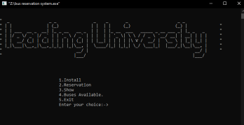
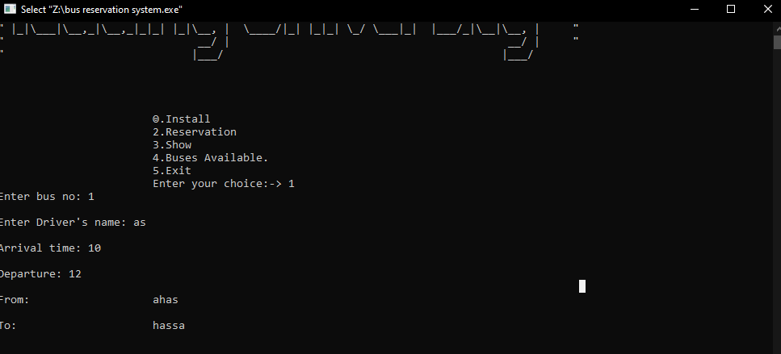
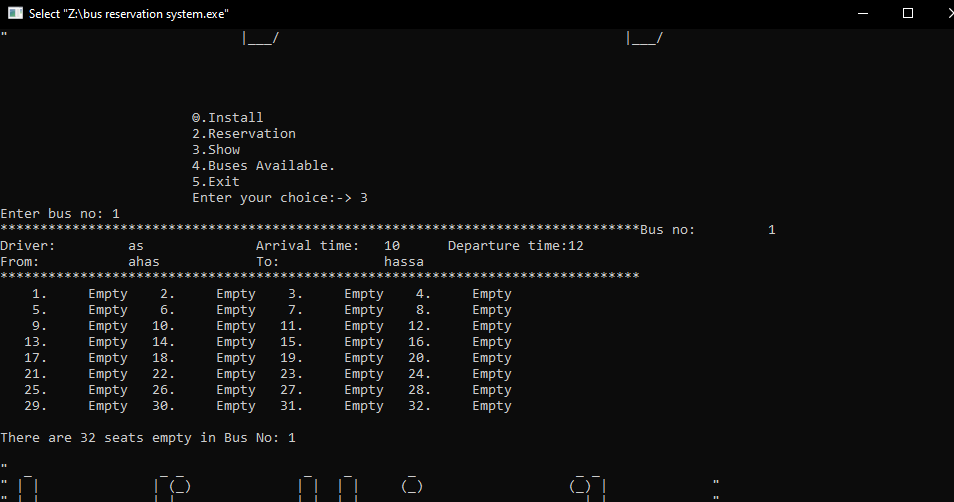
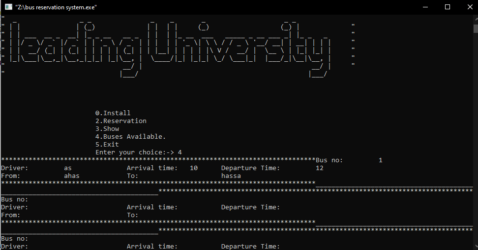

# Bus Seat Reservation System

This project is a Bus Seat Reservation System developed using C++. It allows users to reserve seats, check seat availability, and cancel reservations.

## Features

- **Install New Bus**: Add a new bus to the system with details like bus number, driver's name, arrival and departure times, origin, and destination.
- **Seat Allotment**: Reserve a seat for a passenger by entering the bus number and selecting an available seat.
- **Show Bus Details**: Display detailed information about a specific bus, including the bus number, driver, arrival and departure times, origin, destination, and reserved seats.
- **Check Seat Availability**: View available seats for all buses in the system.

## Screenshots

### Landing Screen


### Home Screen


### Seat Selection


### Details Selection



## Installation

1. Clone the repository:
   ```sh
   git clone https://github.com/MrRoy121/Bus-Seat_Researvation_System_C-plus-plus.git